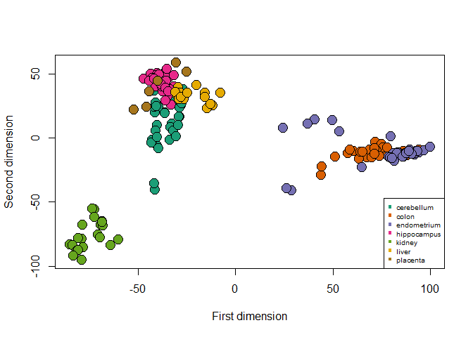
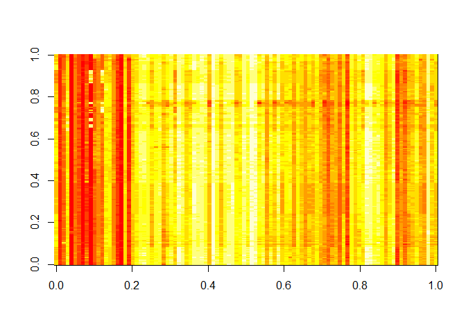
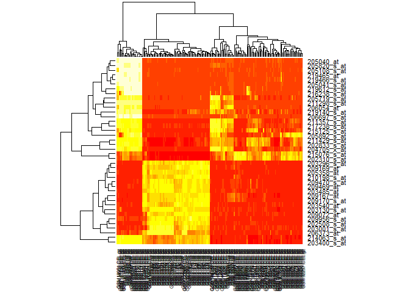
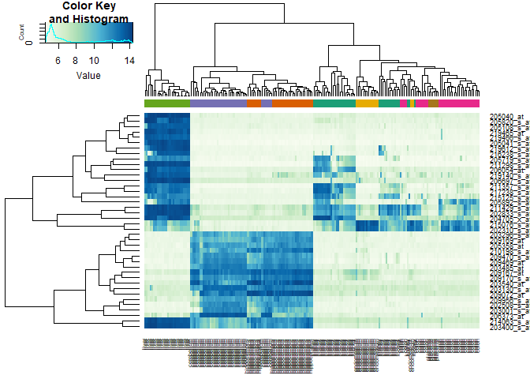
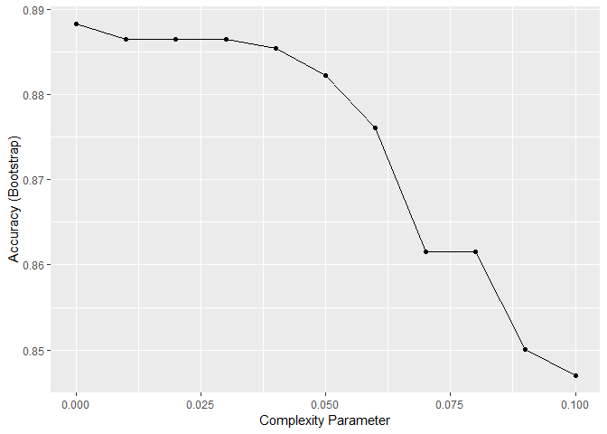
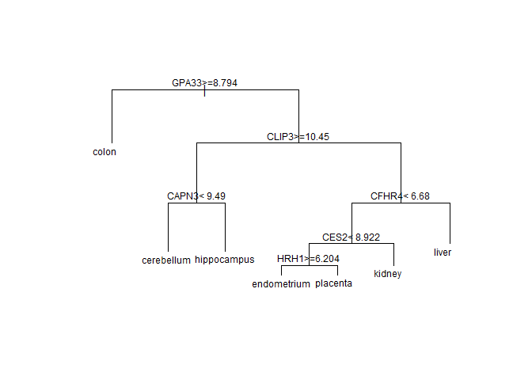
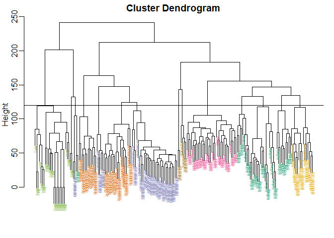
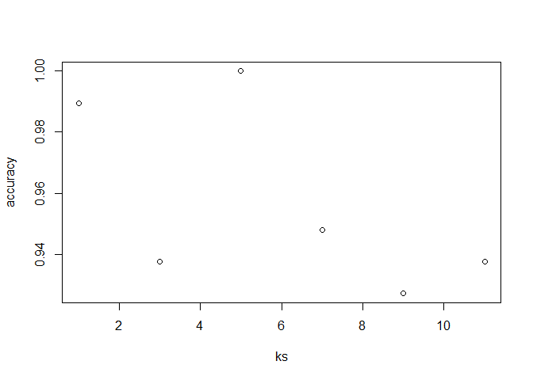

Tissue Gene Expression
================

Gene expression of 7 tissues: cerebellum, colon, endometrium, hippocampus, kidney, liver, placenta with few genes

``` r
load("tissuesGeneExpression.rda")
```

Plot with multidimentional scaling

``` r
# transpose and get the rowwise distance
d <- dist(t(e))
mds <- cmdscale(d)
```

``` r
plot(mds[,1], mds[,2], bg=palette(brewer.pal(7, "Dark2"))[as.fumeric(tissue)],pch=21,
     xlab="First dimension", ylab="Second dimension",
     cex=2) 
legend("bottomright", legend = levels(as.factor(tissue)),
       col=seq(along=levels(as.factor(tissue))), pch=15,cex=0.65)
```



``` r
# image the gene expression
image(e[1:100,]) 
```



Yellow high expression, red low expression, colour represents the number, each pixel/square represent each gene.

Pick few genes to demonstrate the gene expression with help of image pixels

``` r
rv <- rowVars(e)
# taking top 40 genes that vary the most, most rowvariance
idx <- order(-rv)[1:40] 
```

Heatmap of a subset of the 40 gene showing most variation. Here genes are clustered and samples are clustered. Colours shows the measurments, yellow are most expressed in that particular cluster.

``` r
heatmap(e[idx, ]) 
```



Each tissue get diff colors. green to blue, high expression=blue, low expression green

``` r
hmcol <- colorRampPalette(brewer.pal(9, "GnBu"))(100)
cols <- palette(brewer.pal(7, "Dark2"))[as.fumeric(tissue)]
col_tissue <- cbind(colnames(e), tissue, cols)
head(col_tissue)
```

    ##                        tissue   cols     
    ## [1,] "GSM11805.CEL.gz" "kidney" "#1B9E77"
    ## [2,] "GSM11814.CEL.gz" "kidney" "#1B9E77"
    ## [3,] "GSM11823.CEL.gz" "kidney" "#1B9E77"
    ## [4,] "GSM11830.CEL.gz" "kidney" "#1B9E77"
    ## [5,] "GSM12067.CEL.gz" "kidney" "#1B9E77"
    ## [6,] "GSM12075.CEL.gz" "kidney" "#1B9E77"

``` r
heatmap.2(e[idx, ], labCol = tissue,
          trace= "none",
          ColSideColors = cols, # colum side colors
          col=hmcol)
```



### Modeling with Decision tree

``` r
data("tissue_gene_expression")
```

``` r
set.seed(1991)

fit <- with(tissue_gene_expression, 
            train(x, y, method = "rpart",
                  tuneGrid = data.frame(cp = seq(0, 0.1, 0.01))))
ggplot(fit)
```



``` r
confusionMatrix(fit)
```

    ## Bootstrapped (25 reps) Confusion Matrix 
    ## 
    ## (entries are percentual average cell counts across resamples)
    ##  
    ##              Reference
    ## Prediction    cerebellum colon endometrium hippocampus kidney liver
    ##   cerebellum        19.3   0.0         0.3         1.1    0.3   0.0
    ##   colon              0.3  16.5         0.1         0.0    0.1   0.0
    ##   endometrium        0.1   0.2         5.6         0.1    1.5   0.1
    ##   hippocampus        0.2   0.0         0.0        15.3    0.1   0.0
    ##   kidney             0.3   0.3         1.7         0.1   18.7   0.5
    ##   liver              0.0   0.0         0.3         0.0    0.3  12.6
    ##   placenta           0.2   0.0         0.4         0.0    0.5   0.1
    ##              Reference
    ## Prediction    placenta
    ##   cerebellum       0.2
    ##   colon            0.1
    ##   endometrium      1.3
    ##   hippocampus      0.0
    ##   kidney           0.3
    ##   liver            0.2
    ##   placenta         0.9
    ##                             
    ##  Accuracy (average) : 0.8878

``` r
plot(fit$finalModel, margin = 0.1) 
text(fit$finalModel, cex = 0.75)
```



### Modeling with Hierarchial clustering

``` r
data(tissuesGeneExpression)
d <- dist(t(e))
hc <- hclust(d)
# class(hc)
# plot(hc, cex=0.5, label=tissue)
```

``` r
mypar(1,1)
myplclust(hc, cex=0.5, label=tissue,
          lab.col=as.fumeric(tissue))
abline(h=120)
```



``` r
cl <- cutree(hc, h=120)
table(true=tissue, cluster=cl)
```

    ##              cluster
    ## true           1  2  3  4  5  6  7  8  9 10 11 12 13 14
    ##   cerebellum   0  0  0  0 31  0  0  0  2  0  0  5  0  0
    ##   colon        0  0  0  0  0  0 34  0  0  0  0  0  0  0
    ##   endometrium  0  0  0  0  0  0  0  0  0  0 15  0  0  0
    ##   hippocampus  0  0 12 19  0  0  0  0  0  0  0  0  0  0
    ##   kidney       9 18  0  0  0 10  0  0  2  0  0  0  0  0
    ##   liver        0  0  0  0  0  0  0 24  0  2  0  0  0  0
    ##   placenta     0  0  0  0  0  0  0  0  0  0  0  0  2  4

### Modeling with K nearest neighbour KNN

``` r
dim(as.matrix(tissue_gene_expression))
```

    ## [1] 2 1

``` r
x <- tissue_gene_expression$x
rownames(x) <- NULL
dim(as.matrix(x))
```

    ## [1] 189 500

``` r
y <- tissue_gene_expression$y
dim(as.matrix(y))
```

    ## [1] 189   1

``` r
x <- as.data.frame(x)
y <- as.data.frame(y)
```

``` r
ks <- c(1, 3, 5, 7, 9, 11)
set.seed(1)
accuracy <- sapply(ks, function(k){
  test_index <- createDataPartition(y$y, times=1, p=0.5, list = FALSE)
  #sample(1:nrow(y),0.5*nrow(y))
  test_y <- y[test_index, ]
  train_y <- y[-test_index, ]
  test_x <- x[test_index, ]
  train_x <- x[-test_index, ]
  fit <- knn3(train_x, train_y, k=k)
  
  y_hat <- predict(fit, test_x, type = "class") #%>% factor(levels = levels(train_y))
  
  confusionMatrix(data = y_hat, reference = test_y)$overall["Accuracy"] 
})

accuracy
```

    ##  Accuracy  Accuracy  Accuracy  Accuracy  Accuracy  Accuracy 
    ## 0.9895833 0.9375000 1.0000000 0.9479167 0.9270833 0.9375000

``` r
plot(ks, accuracy)
```



####### Ref: Rafael Irizarry & Michael Love, High dimensional data analysis, Harvardx, edx.
